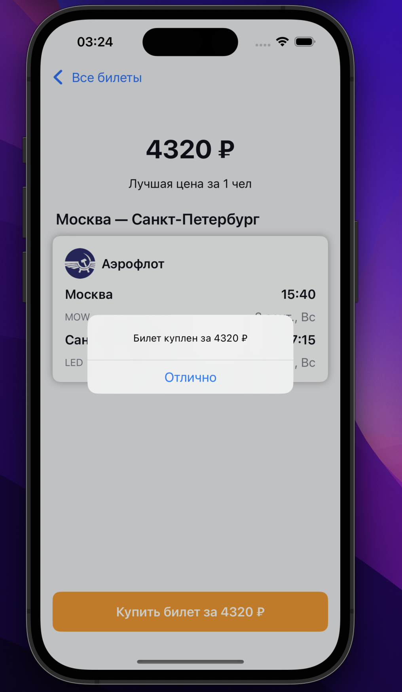
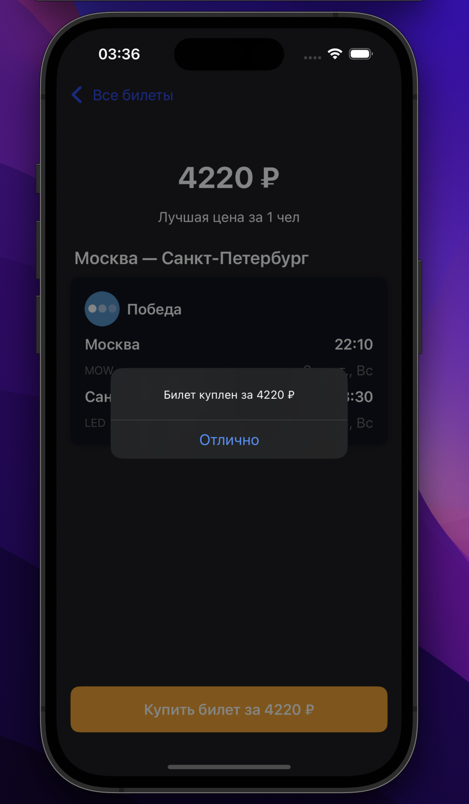
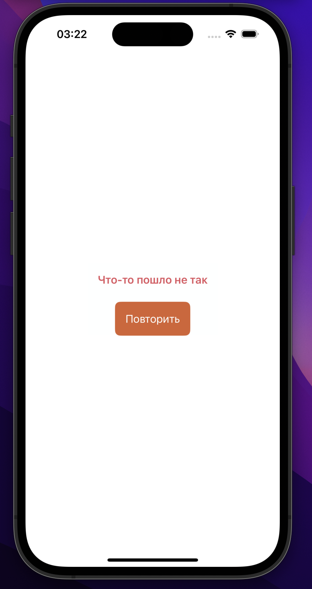
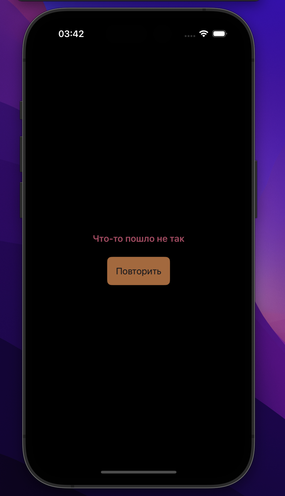
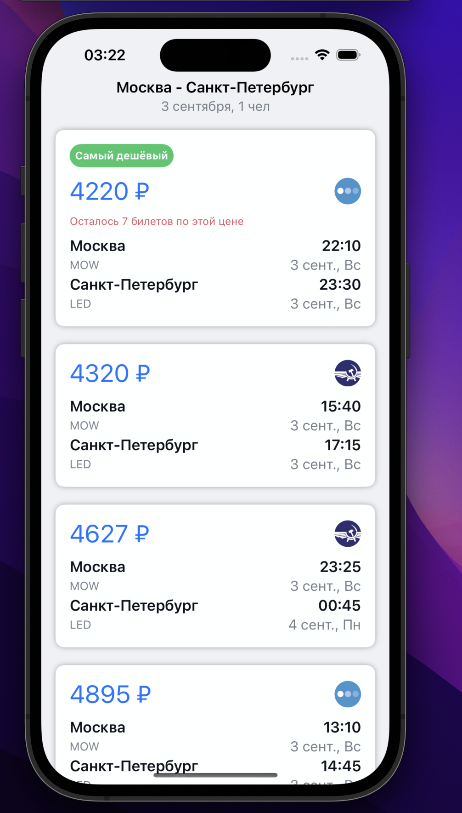
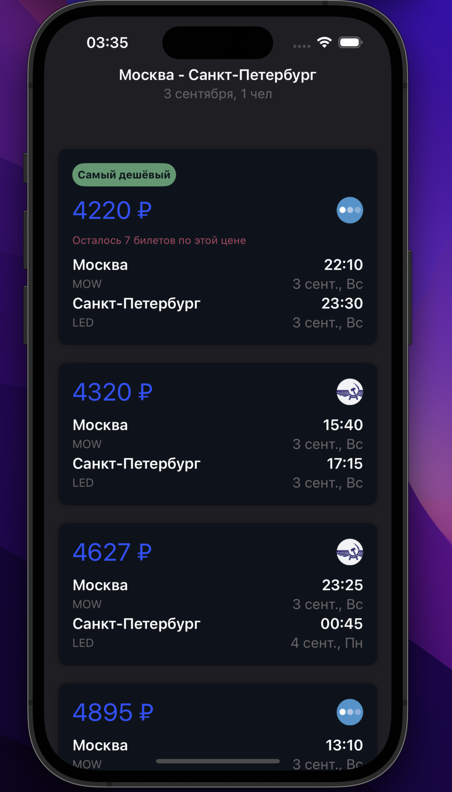
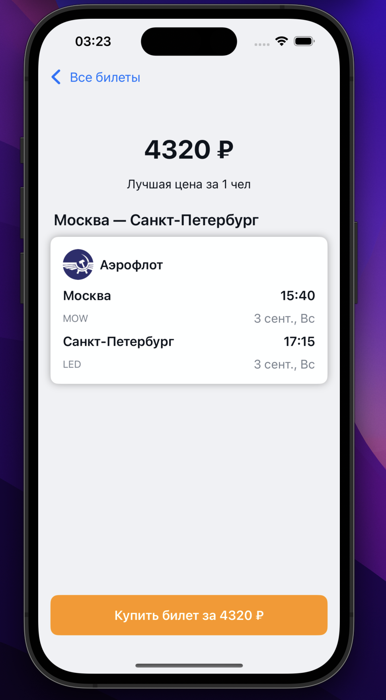
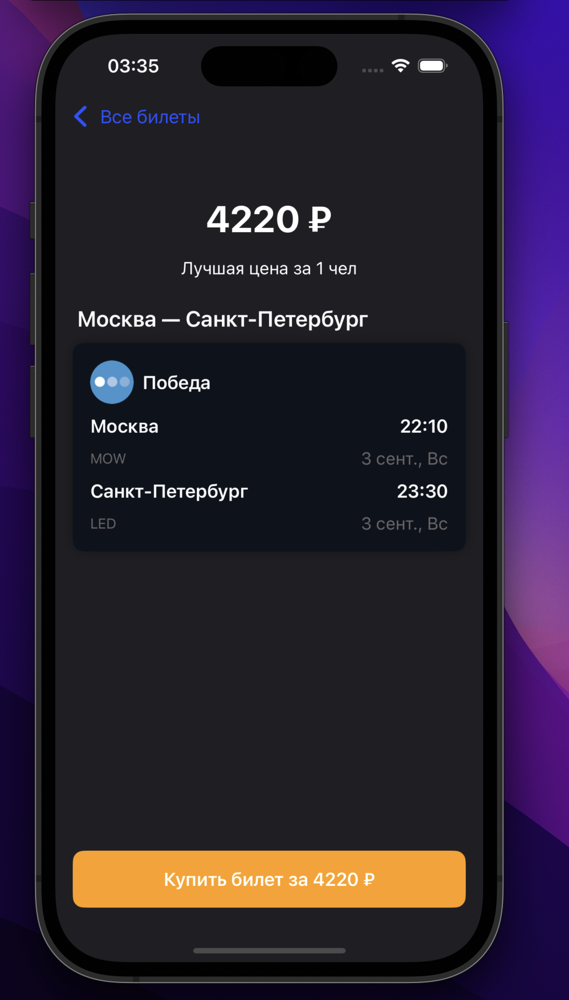

## Функциональные требования

1. Получить массив рейсов от сервера на старте приложения
2. Отсортировать от самого дешёвого к самому дорогому и отобразить на экране списком
3. У самого дешёвого должен быть бейдж **Самый дешёвый**
4. Если для рейса осталось меньше 10 билетов, то на карточке должно быть написано про это
5. При тапе на рейс открывается детальный экран
6. На детальном экране по нажатию кнопки **Купить** показывается алерт **Куплен билет за X ₽,** где X — это цена выбранного билета
   
 

## Технические требования

1. Выполненное задание должно быть **выложено в открытом репозитории на GitHub**
2. Проект iOS 16+
3. Пользовательский интерфейс на SwiftUI
4. Сетевые запросы можно сделать с помощью async/await, либо классическим способом через completion handler’ы
  Сетевые запросы сделаны с помощью async/await
6. Модели ответов необходимо парсить с помощью протокола Codable

## Дополнительные задания, но не обязательные

1. В момент загрузки в центре экрана крутится индикатор загрузки. 
Если случилась ошибка загрузки, то в центре экрана текст **Что-то пошло не так** и кнопка **Повторить**, которая заново отправляет запрос
 
3. Поддержка тёмной темы (цвета для неё должны быть чуть менее яркими, чем в светлой)
 

 

5. Использовать MVVM или UDF архитектуру, можно TCA

   Использована MVVM
7. Любые тесты на твой выбор

   2 unit теста: 1) на получение данных из сети 2) сортировка билетов по цене 
9. Описание репозитория на GitHub, где указано, что сделано и какие решения приняты в ходе разработки
